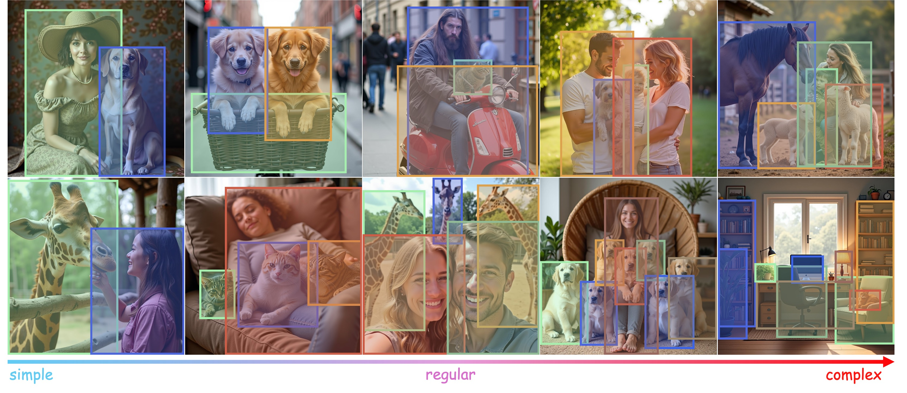

<h1 align="center">OverLayBench: A Benchmark
for Layout-to-Image Generation with Dense Overlaps</h1>


<p align="center">
    <a href="https://arxiv.org/abs/2509.19282" target="_blank">
        </a>
    <a href="https://mlpc-ucsd.github.io/OverLayBench/" target="_blank">
        </a>
    <a href="https://huggingface.co/datasets/cywang143/OverLayBench_Eval" target="_blank">
        </a>
</p>

<p align="center">
    <a href="https://www.bingnanli.com"><strong><ins>Bingnan Li <sup>1*</sup></ins></strong></a>
    ·
    <a href="https://www.linkedin.com/in/chenyu-wang-profile/"><strong><ins>Chen-Yu Wang <sup>1*</sup></ins></strong></a>
    ·
    <a href="https://xxuhaiyang.github.io"><strong><ins>Haiyang Xu <sup>1*</sup></ins></strong></a>
    ·
    <a href="https://xzhang.dev"><strong><ins>Xiang Zhang <sup>1</sup></ins></strong></a>
    ·
    <a href="https://scholar.google.com/citations?user=LE6bioEAAAAJ&hl=en"><strong><ins>Ethan Armand <sup>1</sup></ins></strong></a>
    ·
    <a href="https://scholar.google.com/citations?user=kw6DWjsAAAAJ&hl=en"><strong><ins>Divyansh Srivastava <sup>1</sup></ins></strong></a>
    ·
    <a href="https://shanxiaojun.github.io"><strong><ins>Xiaojun Shan <sup>1</sup></ins></strong></a>
    ·
    <a href="https://zeyuan-chen.com"><strong><ins>Zeyuan Chen <sup>1</sup></ins></strong></a>
    ·
    <a href="http://www.stat.ucla.edu/~jxie/"><strong><ins>Jianwen Xie <sup>2</sup></ins></strong></a>
    ·
    <a href="https://pages.ucsd.edu/~ztu/"><strong><ins>Zhuowen Tu <sup>1</sup></ins></strong></a>
</p>
<p align="center">
    <sup>1</sup>UC San Diego
    ·
    <sup>2</sup>Lambda, Inc.
</p>


<p align="center">
    Examples from <em>OverLayBench</em> with difficulty increasing from left to right.
</p>

## 📖 Abstract

>Despite steady progress in layout-to-image generation, current methods still struggle with layouts
containing significant overlap between bounding boxes. We identify two primary challenges: (1) large
overlapping regions and (2) overlapping instances with minimal semantic distinction. Through both
qualitative examples and quantitative analysis, we demonstrate how these factors degrade generation
quality. To systematically assess this issue, we introduce OverLayScore, a novel metric that
quantifies the complexity of overlapping bounding boxes. Our analysis reveals that existing
benchmarks are biased toward simpler cases with low OverLayScore values, limiting their
effectiveness in evaluating models under more challenging conditions. To reduce this gap, we present
OverLayBench, a new benchmark featuring balanced OverLayScore distributions and high-quality
annotations. As an initial step toward improved performance on complex overlaps, we also propose
CreatiLayout-AM, a model trained on a curated amodal mask dataset. Together, our contributions
establish a foundation for more robust layout-to-image generation under realistic and challenging
scenarios.

## 🔥 News

- **[2024-06-17]**: The code and the evaluation toolkit are released!
- **[2025-09-19]**: OverLayBench is accepted by NeurIPS 2025 D&B Track! 🎉🎉🎉
- **[2025-09-23]**: The preprint is available on [arXiv](https://arxiv.org/abs/2509.19282)!

## 🚀 Quick Start

### 🤖 Install Dependencies

If you are using Multi-GPUs, we recommend you to use [vllm](https://github.com/vllm-project/vllm) for accelerated inference.

```bash
git clone https://github.com/cuttle-fish-my/OverLayBenchPyTools.git
cd OverLayBenchPyTools
conda create -n overlaybench python=3.10.16 --yes
conda activate overlaybench
bash install_vllm.sh
```
Otherwise, you may also choose to use the default huggingface transformers, which is slower but more stable.
```bash
git clone https://github.com/cuttle-fish-my/OverLayBenchPyTools.git
cd OverLayBenchPyTools
conda create -n overlaybench python=3.10.16 --yes
conda activate overlaybench
bash install.sh
```

### 🧪 Evaluate Your Own Model!
According to the [discussion](https://github.com/vllm-project/vllm/issues/8893#issuecomment-2379405305), for vllm inference, please set environment variable `VLLM_WORKER_MULTIPROC_METHOD=spawn` before running the code.
Also, please make sure the `OverLayBenchMeter` is initialized within `if __name__ == "__main__":` block to avoid the `RuntimeError: Cannot re-initialize CUDA in forked subprocess` error.

```python
from overlaybenchpytools.meter import OverLayBenchMeter

if __name__ == "__main__":
    meter = OverLayBenchMeter(
        root='{YOUR_GENERATED_IMAGES_DIR}',
        extension='png', save_dir='./metrics',
        resolution=1024, bs_qwen="all", use_vllm=True,
        vllm_args={"tensor_parallel_size": 8})
    for split in ["simple", "medium", "hard"]:
        meter.set_split(split, '{YOUR SEED}')
        meter.evaluate()
```

For `transformers` based inference, please remove the `use_vllm` and the `vllm_args` argument and set `bs_qwen` to a reasonable size.

```python
from overlaybenchpytools.meter import OverLayBenchMeter

if __name__ == "__main__":
    meter = OverLayBenchMeter(
        root='{YOUR_GENERATED_IMAGES_DIR}',
        extension='png', save_dir='./metrics',
        resolution=1024, bs_qwen=8)
    for split in ["simple", "medium", "hard"]:
        meter.set_split(split, '{YOUR_SEED}')
        meter.evaluate()
```

`OverLayBenchMeter` covers the evaluation of `mIoU`, `Overlay mIoU(o-mIoU)`, `Entity Success Rate (SR_E)`,
`Relashionship Success Rate (SR_R)`, `Relationship Success Rate (SR_R)`, `Global CLIPScore` and `Local CLIPScore`.
For `FID`, please refer to the [IQA-PyTorch](https://github.com/chaofengc/IQA-PyTorch) package.


<p align="center">
Comparison of generated images from different models on <em>OverLayBench</em>.
</p>

## 🤝 Acknowledgements


We deeply appreciate the contributions of the following projects:

- [QWen2.5 VL](https://huggingface.co/collections/Qwen/qwen25-vl-6795ffac22b334a837c0f9a5)
- [Diffusers](https://github.com/huggingface/diffusers)
- [FLUX](https://github.com/black-forest-labs/flux)
- [IQA-PyTorch](https://github.com/chaofengc/IQA-PyTorch)
- [VLLM](https://github.com/vllm-project/vllm)
- [OpenCLIP](https://github.com/mlfoundations/open_clip)
## ✏️ Citation


```bibtex
@misc{li2025overlaybenchbenchmarklayouttoimagegeneration,
      title={OverLayBench: A Benchmark for Layout-to-Image Generation with Dense Overlaps}, 
      author={Bingnan Li and Chen-Yu Wang and Haiyang Xu and Xiang Zhang and Ethan Armand and Divyansh Srivastava and Xiaojun Shan and Zeyuan Chen and Jianwen Xie and Zhuowen Tu},
      year={2025},
      eprint={2509.19282},
      archivePrefix={arXiv},
      primaryClass={cs.CV},
      url={https://arxiv.org/abs/2509.19282}, 
}
```